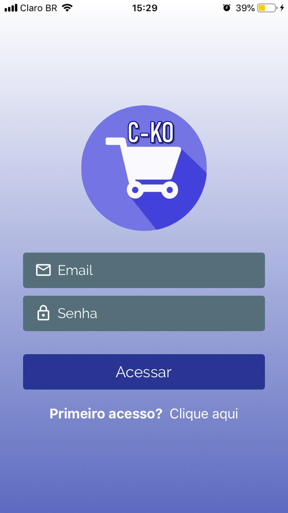
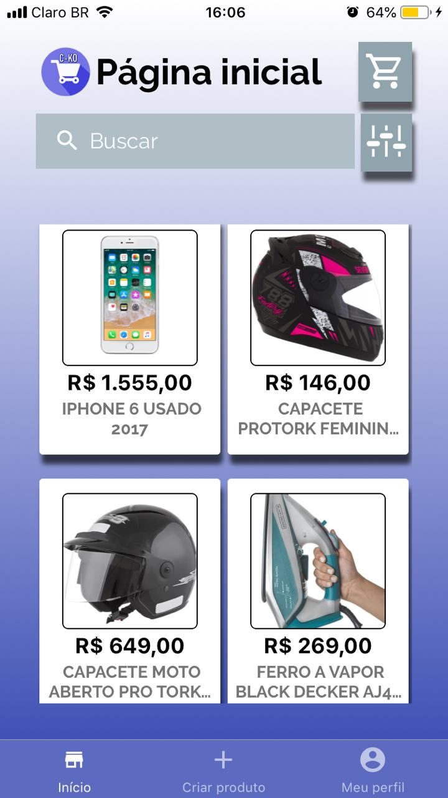
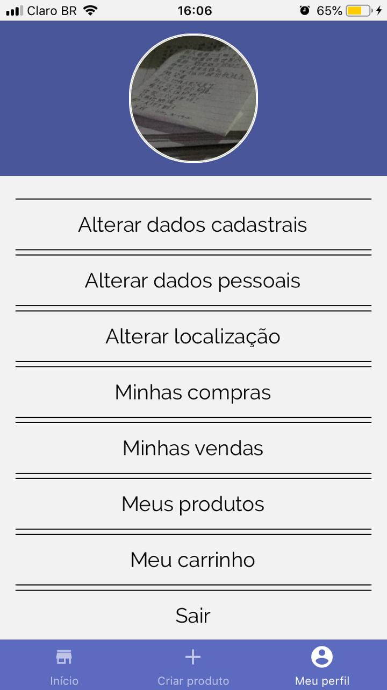

# C-CKO PROJECT 

This is a project developed by me using the most recent technologies.
It can be consired asa a E-COMMERCE app, once there will be interactions between sellers and buyers.
They will be free to commercialize their products on the APP.
The main library used is **REACT-NATIVE** to work on mobile front-end.

The main screens of the mobile application: 

| Login Page | Home page | Profile page |
| --- | --- | --- |
|  |  | 

The language used on the app is Portuguese.

## What I used to develop it ?

Developing this app I used so many new libraries to handle with: credit-card, grabbing the album pictures from the user cellphone, asking for permissions from expo, number input and other libraries useful to style the application.
I styled the whole project with styled-components which is a handyl library.
About dealing with storage on front-end, I used: redux, redux-persist redux-saga and others to make the application store some short period informations or some of a bit longer by using the redux-persist with ASYNC STORAGE.

The back-end part is on this repository:
[BACK-END C-KO E-COMMERCE](https://github.com/lucascicco/POSTGRES-BACK-END-CKO-PROJECT)

Please, check it out. 
I am open minded about new suggestions.
Thank your for reading.

Created by Lucas Vitor.
