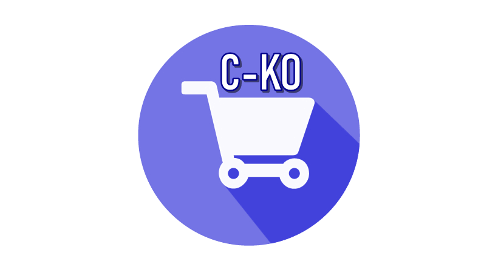

# C-CKO PROJECT 

Este é um projeto desenvolvido por mim utilizando as tecnologias mais recentes.
Pode ser considerado um aplicativo E-COMMERCE, haverá interações entre vendedores e compradores.
Eles terão liberdade para comercializar seus produtos no APP.
A principal biblioteca usada é **REACT-NATIVE** para trabalhar no front-end móvel.

This is a project developed by me using the most recent technologies.
By the fact it is a E-COMMERCE app, it will have interactions between sellers and buyers.
They will be free to commercialize their products on the APP.
The main library used is **REACT-NATIVE** to work on mobile front-end.

As telas principais do aplicativo móvel:
The main screens of the mobile application: 

| Login Page | Home page | Profile page |
| --- | --- | --- |
|  |  | 

O idioma usado no aplicativo é o português.
The language used on the app is Portuguese.

## O que usei para desenvolvê-lo? What I used to develop it ?

Desenvolvendo este aplicativo, usei muitas novas bibliotecas para lidar com: cartão de crédito, pegando as fotos do álbum do celular do usuário, pedindo permissões da Expo, entrada de números e outras bibliotecas úteis para estilizar o aplicativo.
Eu estilizei todo o projeto com  styled-components, o que é uma biblioteca útil.
Sobre lidar com armazenamento no front-end, usei: redux, redux-persist redux-saga e outros para fazer o aplicativo armazenar algumas informações de curto período ou um pouco mais longas usando o redux-persist com ASYNC STORAGE.

Developing this app I used so many new libraries to handle with: credit-card, grabbing the album pictures from the user cellphone, asking for permissions from expo, number input and other libraries useful to style the application.
I styled the whole project with styled-components which is a handy library.
About dealing with storage on front-end, I used: redux, redux-persist redux-saga and others to make the application store some short period informations or some of a bit longer by using the redux-persist with ASYNC STORAGE.

O back-end está neste repositório:
The back-end part is on this repository:
[BACK-END C-KO E-COMMERCE](https://github.com/lucascicco/POSTGRES-BACK-END-CKO-PROJECT)

A aplicação para WEB:
The WEB APP is on this repository:
[FRONT-END WEB C-CKO E-COMMERCE](https://github.com/lucascicco/C-KO-REACT)

Please, check it out. 
I am open minded about new suggestions.
Thank you for reading.

Por favor, confira.
Estou aberto a novas sugestões.
Obrigado por ler.

Desenvolvido por,

Developed by,

lucascicco.
